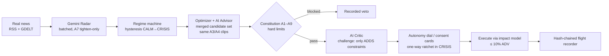

# KAVACH

**Event-Aware Capital Governor for Indian Markets**

[](./.github/workflows/ci.yml)
[](./LICENSE)
[](#test-matrix)
[](#indian-money-discipline)

> KAVACH is a production-grade decision-support console for an autonomous
> capital agent: an optimizer that proposes, a constitution that disposes,
> real news perceived by Gemini, AI voices (advisor + critic) that
> participate in the decision loop with zero authority, human consent on
> tap, and a hash-chained flight recorder that proves every choice —
> demonstrated on three replayed Indian crises and on a live paper book fed
> by real market data and real headlines.
>
> **It is educational software. It never places real orders. It is not
> investment advice.**

---

## Quickstart (3 commands, zero keys)

```bash
git clone https://github.com/<you>/kavach && cd kavach
bun install && bunx prisma db push
bun run dev
```

Open `http://localhost:3000` → **REPLAY LAB** → press `3` (COVID-2020) →
`Space` to autoplay the A/B crisis replay. No API keys needed: Gemini, news
providers and prices all degrade gracefully to deterministic fallbacks.
Add `GEMINI_API_KEY` (free tier is fine) to make the AI live — see
[`.env.example`](./.env.example) and [docs/DEPLOY.md](./docs/DEPLOY.md) for
Vercel/Docker paths.

## The two rooms

| | REPLAY LAB | LIVE PAPER |
|---|---|---|
| **What it is** | Three scripted Indian crises, replayed twice on the same seeded world (seed 42) | The ₹1,000 Cr paper book marked to real data |
| **Prices** | Deterministic engine calibrated to historical closes | Yahoo (^NSEI, USDINR=X, GC=F×FX); bonds MARK-TO-MODEL |
| **News** | Scripted headlines | Real: Google News RSS + GDELT (zero-key), optional keyed providers |
| **AI** | Dictionary radar (determinism gate) | Gemini radar + Advisor + Critic in the loop, zero authority |
| **Determinism** | Byte-identical recorder hash chains | Resumable durable state; chain continues across restarts |
| **Trades** | Simulated through the impact model | Simulated through the same impact model — **never real orders** |

Both rooms share one desk surface: a **⌘K command palette** (every console action,
keyboard-first), a **risk-budget strip** (CVaR / gross / LIQ vs the same caps the
optimizer is held to), a **session blotter** (every executed paper trade with its
origin — optimizer · AI · human · forced — read straight back from the hash chain,
never a parallel accounting), **sleeve trend sparklines** on real marks, a durable
**session history** (SQLite), a market-open **countdown**, and one-click **exports**
(A/B equity CSV, blotter CSV, book-history CSV, recorder JSONL, post-mortem .md).

### The decision pipeline (both rooms, same code)



## Why it exists: the anti-1987 machine

March 2020: every quant fund's optimizer said "SELL" at the same instant, into
the same collapsed liquidity, with the same leveraged book. The machines were
individually rational and collectively catastrophic. KAVACH is the opposite
architecture: **the optimizer can propose anything; the constitution only
permits what survives a stress test; the flight recorder proves every
choice.** AI is welcome inside the loop — as perception and as adversarial
challenge — but it holds zero authority and can only tighten.

The demo that makes it concrete — IL&FS 2018 on the same world, same seed:

| | NaiveBot | KAVACH-governed |
|---|---|---|
| NAV after 45 days | ₹742.22 Cr (−25.78%) | ₹800.39 Cr (−19.96%) |
| Peak ADV participation | **279%** of ADV | **10.0%** (A3 cap) |
| Impact paid | ₹37.05 Cr | ₹5.00 Cr |
| Forced-sale cascade days | 13 | 0 |

COVID-2020: naive −10.94% vs governed −3.21%. Taper-2013: the difference is
small (+₹11.5 Cr) — because 2013 was survivable; that honesty is calibrated,
not narrated.

## The constitution (A1–A9)

| | Article | Enforcement |
|---|---|---|
| A1 | LIQ ≥ 5% NAV at all times | Script-forced breaches flagged, never silently waived |
| A2 | Max 40% of gross in any bucket | Blocks deterioration; permits remediation |
| A3 | Trade ≤ 10% of current ADV | Hard block; re-clipped even on human-approved trades |
| A4 | 1-day 95% CVaR ≤ 2.5/2.0/1.5% by regime | One-way valve on risk |
| A5 | Unencumbered LIQ ≥ 2× projected next-day margin | Floors the LIQ buffer |
| A6 | LIQ ≥ max(5%, 3-day redemption pace) | Floors the LIQ buffer |
| A7 | **AI may only tighten — never loosen** | Structural; forged outputs → `REJECTED_BY_A7` |
| A8 | Human overrides via consent cards + counterfactuals | All recorded with decider + re-clip |
| A9 | Radar unavailable → deterministic dictionary | Fail-safe, never freeze |

The **autonomy dial** (FULL → SUPERVISED → CONSERVATIVE) is a one-way ratchet
in CRISIS (EU AI Act Art. 14 pattern): severity-4 events notch it toward more
scrutiny automatically; nothing can notch it back mid-crisis. AI Critic
verdicts can *raise* the approval bar; there is no code path by which any AI
output lowers a limit.

## The flight recorder

Append-only JSONL, SHA-256 over canonical payloads, `prev_hash → entry_hash`
chaining, size-rotated (5 MB × 10 files). Every observation, margin call,
radar event (including A7 rejections), optimizer iteration, constitution
evaluation, AI proposal with its clip reason, consent card, approval,
timeout, execution and impact cost lands in it. Browse it live in the UI
("audit" button) or via
`GET /api/kavach/{live|replay}/flightrecorder?from=&to=`. The SQLite DB is
operational state; **the recorder is evidence** — deliberately distinct.

## LIVE PAPER details

- **Prices**: Yahoo Finance chart endpoint (unofficial, documented as
  fragile; 10-min cache + last-known-good with a visible stale flag).
  EQ = ^NSEI, GOLD = GC=F × USD/INR, applied as relative moves on the
  calibrated day-0 book. **GSEC/IGCORP/CRED are MARK-TO-MODEL** — no free
  Indian bond tickers exist; radar-severity × duration × spread-bp factors
  drive them, labeled `MTM` in the UI. The honest label is a feature.
- **News**: Google News RSS (India edition) + GDELT DOC 2.0, zero-key,
  deduped (URL-hash + trigram ≥ 0.8). Optional GNews/Marketaux/Finnhub via
  env keys. All-provider failure → `NEWS FEED DEGRADED`, keeps last cache.
- **Market hours**: rebalances only Mon–Fri 09:15–15:30 IST (approximate
  holiday list — see limitations).
- **Gemini budget**: batched radar (≤ 20 headlines/call, 15-min cadence),
  one advisor + one critic per rebalance, ≤ 8 req/min client-side, one retry
  on 429/5xx, 2-strike circuit breaker, and a hard
  `MAX_AI_CALLS_PER_DAY=150` counter persisted per IST day — **only real
  network attempts count** (nokey/dictionary rows are audited but free), so
  a zero-key run can never fake `AI BUDGET SPENT`. Spent → badge +
  dictionary mode. Every call audited (role, model, prompt hash, latency,
  tokens, outcome) — your SR 26-2 story.
- **GDELT etiquette**: queries are serialized (≤ 1 req / 5 s per IP, 2-topic
  cap, 6 s timeouts) and the upstream rate-limit body — HTTP 200 with a
  TEXT payload — is detected and reported as a provider failure instead of
  silently parsing to "0 articles, ok".
- **Stress lens** (what-if pre-mortem): project today's LIVE book through a
  scripted crisis (TANTRUM-13 / IL&FS-18 / COVID-20) as a buy-and-hold
  counterfactual — no trades, no constitution action. The desk-stop line,
  A4 CRISIS CVaR and the A1 LIQ floor are drawn as *reference lines on the
  unmanaged path*: the ride the governed loop refuses to take.
- **Durability**: sessions, snapshots, radar events, the pending approval
  queue and AI-call audits in SQLite/Turso; a pending consent card is still
  answerable after a server bounce (tested).

## Calibration (seed 42, world mode — 29/29 gates)

| Metric | Target | Actual |
|---|---|---|
| Day-0 NAV (all scenarios) | ₹1,000.00 Cr exact | ₹1,000.00 Cr ✓ |
| TANTRUM-13: GSEC / EQ / GOLD close | −6.8% / −6.0% / +9.5% | −6.80 / −6.17 / +9.36 ✓ |
| ILFS-18: CRED / IGCORP / GSEC close | −15% / −5% / +2% | −15.19 / −5.07 / +1.97 ✓ |
| COVID-20: EQ / GOLD / GSEC close | −9% / +8% / +2% | −8.53 / +8.17 / +1.99 ✓ |
| GSEC max drawdown (all) | never below −10% | −2.05% worst ✓ |
| IGCORP / CRED / EQ DD caps | −12 / −25 / −35% | −7.21 / −15.19 / −24.98 ✓ |
| Ledger identity, every day | ≤ 1e-8 relative | 0 (float-exact) ✓ |
| Participation cap (governed) | ≤ 10.0% ADV | 10.0% ✓ |

## Test matrix

**172 tests, 0 failures, 1324 assertions** (offline; providers on fixtures;
  dev-server E2E suites auto-skip in CI where no server runs):

| Suite | Count | Covers |
|---|---|---|
| Ledger & invariants | 12 | NAV identity, holdings coherence, margin paid-or-liquidated |
| Calibration (world gates) | 19 | §5.4 targets, DD caps, margin channels |
| Determinism | 2 | Byte-identical hash chains under seed 42 |
| Impact & liquidity | 9 | Almgren-Chriss, ADV mirage, A3 |
| Governor | 13 | Constitution, ratchet, consent, regime hysteresis |
| LLM guardrails | 8+ | Six-layer defense, A7, provider labels |
| Metrics | 6 | EWMA λ=0.94, RU CVaR, FRTB horizon, stress gate |
| Replay + API | 10 | Controller, routes, approvals, post-mortem |
| Formatting | 5 | Indian grouping, ₹ crore/lakh, zero $ |
| Flight recorder | 5 | Chain verify, tamper, resume-across-restart, rotation |
| News adapters (fixtures) | 8 | RSS/GDELT/keyed parse, dedupe, relevance |
| Gemini adapter (mocked) | 8 | Schema/429/timeout/budget/nokey/retry-once paths |
| A7 forged-loosen | 4 | Crafted outputs cannot loosen |
| Advisor clip / Critic | 7 | Constitution pre-clip units, escalation-only |
| LIVE zero-key E2E | 8 | Market-hours gate, durability, accounting, autonomy notch |
| LIVE API + hygiene | 8 | Routes, zod 400s, cron, bundle grep |
| Desk depth (P2-5) | 9 | Blotter origins + A3 on legs, grossCap/bucketPerf, exports (CSV/JSONL chain-linked), sessions, palette surface |
| Stress lens / GDELT honesty / budget semantics (P2-6) | 18 | What-if pre-mortem (shape, direction, desk-stop breach, determinism), throttle-body detection + serialization, counted-only network attempts, stress route zod, console surfaces |

## Indian money discipline

All money is ₹ (INR). Crore/lakh units, Indian digit grouping
(`₹1,01,15,25,000` = ₹10.11 Cr) on every mutable figure, tabular-numerals
mono so numerals never jitter. No `$`, no `M`/`B` suffixes — enforced by
tests.

## Design notes ("a calm quant desk terminal")

Near-black `#09090B`, raised surfaces `#101013`, one hairline border weight
`#1F1F23`. ONE accent — amber `#F5A623` — reserved for AI moments
(advisor proposals, radar severity ≥ 3, autonomy changes). Green/red only
where money moves. Geist Sans + Geist Mono, exactly two families. AI content
lives **in context**: proposals sit inside the trade table with an amber
edge; critic concerns attach to their day; radar events sit beside their
source headline with a link. No gradients, no glass, no confetti — the
terminal is evidence, not decoration.

The desk is keyboard-first: `⌘K`/`?` opens the command palette (crisis
replays, transport, polls, rebalances, exports — filtered, arrow-navigated);
`space` play/pause, `→` step, `1·2·3` crisis, `L` live. Every mutable figure
is mono tabular; toasts and palette animate for 120–150 ms on state change
only, and `prefers-reduced-motion` switches all of it off.

## Limitations (honest)

- **Yahoo Finance is unofficial** and can break; we cache and degrade, but
  LIVE marks can go stale (visibly flagged).
- **Bonds are mark-to-model** — there is no free Indian bond ticker. Yield
  and spread moves are factor-driven from radar events, not market quotes.
- **The NSE holiday list is a hardcoded approximation** (2025–26); Muhurat
  sessions are ignored.
- **ADV estimates are calibrated constants** (EQ proxied from NIFTY volume);
  they are not live per-bucket volumes.
- **Vercel deployments** keep the JSONL recorder per-instance (ephemeral);
  durable state is the DB. Self-host via Docker for a persistent recorder.
- **REPLAY calibration is a model, not history**: closes hit the documented
  targets exactly; the noise, margins and paths are synthetic-but-disciplined.
- **Rate limiting is in-memory per-instance**; front it with a real proxy in
  production.
- The COVID-19 margin figure (₹15.20 Cr ± ₹0.75) is calibrated to the
  script's dual-channel margin model, an approximation of the actual March
  2020 clearing-house dynamics, not a transcription of CCIL data.

## Roadmap

- Per-bucket live ADV from NSE volumes; a proper bond mark source if a free
  one ever appears; consent cards over WebSocket for multi-operator rooms;
  a cassette-style LIVE fixture for UI e2e; Turso-backed recorder for
  serverless deploys.

## Citation spine

- Rockafellar & Uryasev (2000), *Optimization of Conditional Value-at-Risk*
  — the CVaR formulation used by A4.
- RiskMetrics (1996) — EWMA volatility (λ = 0.94).
- Almgren & Chriss (2000) — the market-impact model (κ temporary, γ
  permanent).
- Basel FRTB / RBI directions — the VaR→ES move and liquidity-horizon
  treatment that motivates A4 and the liquidity metric.
- Grossman & Zhou (1993) — drawdown-aware control awareness.
- EU AI Act Art. 14 — the human-oversight pattern behind the autonomy
  ratchet and consent architecture.
- Wachter et al. (2017) — counterfactual explanations on approval cards.
- March 2020 Indian market events (SEBI/RBI circulars, Franklin episode) —
  the design truths behind the margin channels and redemption taps.
- Google Gemini API docs (structured output, free-tier limits) and
  @google/genai; GDELT DOC 2.0; Google News RSS.
- Vercel Geist design system — restraint as a feature.

See [ATTRIBUTIONS.md](./ATTRIBUTIONS.md) for the full reuse policy.

## License

MIT — see [LICENSE](./LICENSE). **KAVACH is educational software. It never
places real orders and is not investment advice.**
